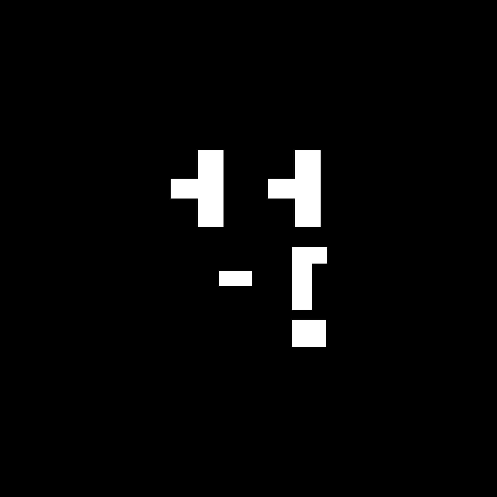
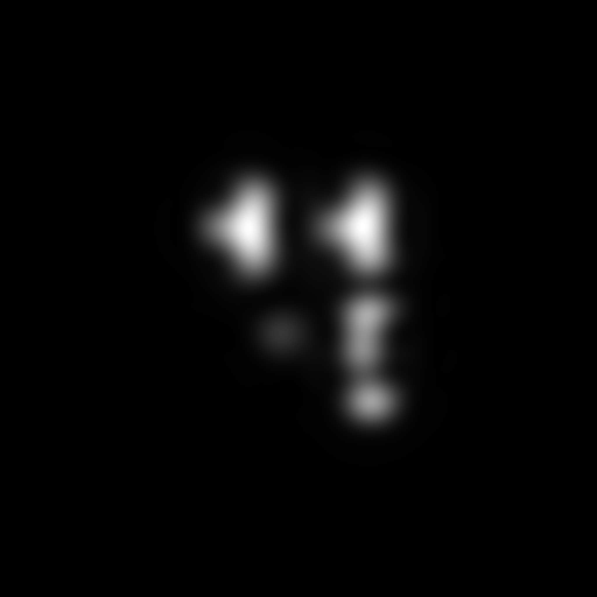
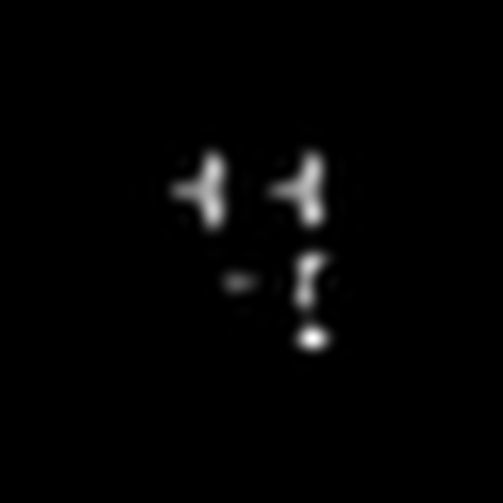

# Table of Contents

- [Introduction to TorchResist](#introduction-to-torchresist)
- [Installation](#installation)
- [Quick Start](#quick-start)
  - [Prepare Mask](#prepare-mask)
    - [7nm Resolution Masks](#7nm-resolution-masks)
  - [Litho Simulation](#litho-simulation)
    - [ICCAD13](#iccad13)
    - [FuILT](#fuilt)
    <!-- - [Potential Third Option](#potential-third-option) -->
  - [Resist Simulation](#resist-simulation)
    - [Usage](#usage)
    - [Features](#features)


---

# Introduction to TorchResist
A Neat Litho-Resist Simulator

The litho model part is forked from FuILT. We calibrate the model parameters on real designs.

We implemented the resist model from scratch and refined it with a calibration set.

---

# Installation

Follow these steps to configure an AnaConda environment named `torchresist`:

**Step 1:** Create a new anaconda environment called torchresist and activate it using following commands:

```bash
conda create -n torchresist python==3.9
conda activate torchresist
```

**Step 2:** To install the required dependencies for this project, ensure that the requirements.txt file is in the current directory, then run the following command:

```bash
pip3 install -r requirements.txt
```

---

# Quick Start

First, clone the repository:

```bash
git clone https://github.com/ShiningSord/TorchResist.git
```

Next, change your directory to the project folder:

```bash
cd TorchResist
```

## Prepare Mask

We use mask data provided by [LithoBench’s GitHub](https://github.com/shelljane/lithobench), please download the source data `lithodata.tar.gz` from the link provided by LithoBench's github:

``` 
https://drive.google.com/file/d/1MzYiRRxi8Eu2L6WHCfZ1DtRnjVNOl4vu/view?usp=sharing
```

Once the source data is downloaded, unzip the data folder and organize it into the required structure:

1. Create a `data` folder in the root directory.
2. Inside `data`, create subdirectories for different mask sources, e.g., `MetalSet`.
3. Within each dataset, create a `1nm` folder under `mask` containing `Images` subfolders: store binary mask images named as `mask000000.png` (six-digit format, starting from 0).


To automate this process, you can use the provided script:
```bash
bash scripts/processmask.sh path/to/lithodata.tar.gz
```
Make sure to replace path/to/lithodata.tar.gz with the actual path where you placed the downloaded lithodata.tar.gz.

A demonstration of the final structure:
```
data/MetalSet/mask/1nm/images/mask000000.png
```

A demo mask image is stored in `demo/mask/`:




### 7nm Resolution Masks

To enhance efficiency, masks can be downsampled to 7nm resolution using a script:

```bash
python3 tools/downsampling.py
```

Output structure:

```
data/MetalSet/mask/7nm/images/cell000000.png
```

---

## Litho Simulation

We provide two Litho Model options: ICCAD13[1,2] and FuILT[3].

### ICCAD13

1. Note: Masks used here have a fixed resolution of 1nm.
2. Use the script to generate lithography results:

```bash
python3 -m examples.iccad13 --mask ./data/MetalSet/mask/1nm/images --outpath ./data/MetalSet/iccad13/1nm/litho --config ./simulator/lithobench/config/lithosimple
```

Output structure:

```
data/MetalSet/iccad13/1nm/litho/images/cell000000.png
data/MetalSet/iccad13/1nm/litho/numpys/cell000000.npy
```

A demo result is stored in `demo/litho/iccad13/`:



### FuILT

1. Use masks with optional 1nm resolution (controlled via a parameter).
2. Generate lithography results:

```
python3 -m examples.fuilt --mask ./data/MetalSet/mask/1nm/images --resolution 1.0 --outpath ./data/MetalSet/fuilt/1nm/litho
```

Output structure:

```
Data/MetalSet/fuilt/1nm/litho/images/cell000000.png
Data/MetalSet/fuilt/1nm/litho/numpys/cell000000.npy
```

A demo result is stored in `demo/litho/fuilt/`:




### References for this section:

1. S. Banerjee, Z. Li, and S. R. Nassif, “ICCAD-2013 CAD contest in mask optimization and benchmark suite,” IEEE/ACM International Conference on Computer-Aided Design (ICCAD), 2013, pp. 271–274.
 
2. S. Zheng, et al., LithoBench: Benchmarking AI Computational Lithography for Semiconductor Manufacturing, GitHub, 2023. Available: https://github.com/shelljane/lithobench

3. Shuo Yin, et al., FuILT: Full Chip ILT System With Boundary Healing, ACM International Symposium on Physical Design (ISPD), Taipei, Mar. 12–15, 2024.

---

## Resist Simulation

TorchResist provides resist parameters for various optical lithography solutions.

### Usage

Simulate resist with the provided script:

```
python3 -m examples.resist --lithomodel FUILT --lithoresult ./data/MetalSet/fuilt/1nm/litho/numpys --outpath ./data/MetalSet/fuilt/1nm/resist --resolution 1.0
```

- `--lithomodel`: Choose `ICCAD13` or `FUILT`.
- `--lithoresult`: Path to the `.npy` lithography result.
- `--outpath`: Directory for output files.
- `--resolution`: Input resolution in nm (default: `1.0`).

Output structure:

```
Data/MetalSet/fuilt/1nm/resist/images/cell000000.png
Data/MetalSet/fuilt/1nm/resist/numpys/cell000000.npy
```

### Features

- **Customizable Parameters:** Adjust resist settings via input arguments for different lithography models and resolutions.
- **Flexible Resolution:** By default, the tool assumes a resolution of 1nm. While this resolution has not been rigorously validated, you can modify it based on your requirements without significantly impacting the results.


---


